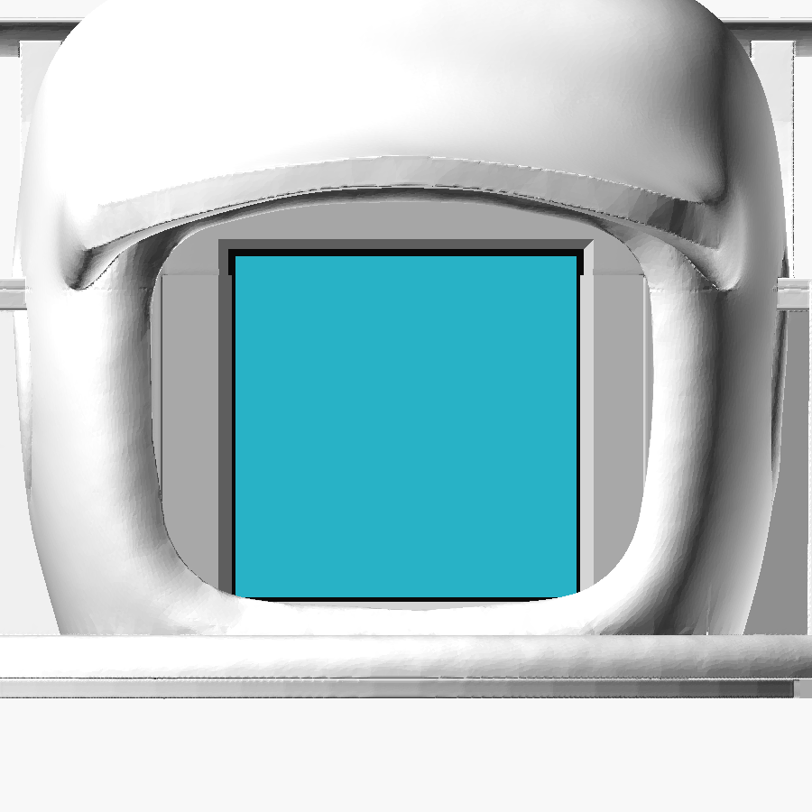
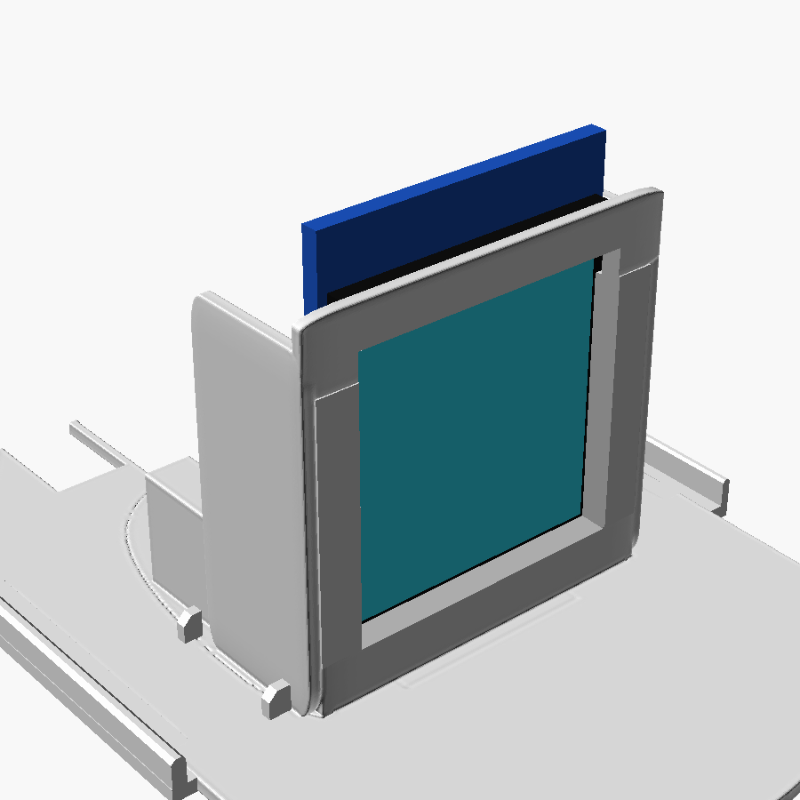

# Case Mochi rzmong — model terbaru

Target hardware **2026**: ESP32-C3 Super Mini + LCD ST7789 **1.3" 240×240** modul **GMT130-V1.0** (Easyware EP002065), PCB **27.78 × 39.22 mm**, **7 pin tanpa CS** (bukan 1.54" / 32 mm).

> Dokumen lama menyebut "23×40 mm" dan "8-pin" — itu **salah**. Ukuran di bawah dari datasheet modul GMT130.

## 🧊 File cetak resmi

| File | Fungsi | Ukuran |
| --- | --- | --- |
| [case_luar_lcd_23_40mm.stl](./case_luar_lcd_23_40mm.stl) | Kulit luar (tidak berubah; nama file lama dipertahankan agar tautan tidak putus) | 35.0 MB |
| [tatakan_GMT130_fit.stl](./tatakan_GMT130_fit.stl) | **Dudukan LCD GMT130** 27.78 × 39.22 mm, pin di bawah — **pakai ini** | 25.9 MB |
| [tatakan_lcd_23_40mm.stl](./tatakan_lcd_23_40mm.stl) | *Legacy* — dudukan lama dari asumsi 23×40 mm yang salah; rongga 32.86 mm vs PCB 27.78 mm, LCD GMT130 goyang ke samping | 28.8 MB |
| [case_luar_lcd_23_40mm_pcb.stl](./case_luar_lcd_23_40mm_pcb.stl) | **Varian PCB carrier**: kulit luar + grille speaker, slot saklar + counterbore, pad tumpuan belakang | 35.1 MB |
| [tatakan_GMT130_fit_pcb.stl](./tatakan_GMT130_fit_pcb.stl) | **Varian PCB carrier**: tatakan GMT130 + 2 tiang M2 Ø5, dinding belakang di balik rel LCD dibuang | 23.8 MB |

Dua cara rakit: **kabel lepas** (`case_luar_lcd_23_40mm.stl` + `tatakan_GMT130_fit.stl`, modul disambung kabel) atau **[PCB carrier](#varian-pcb-carrier)** (dua file `_pcb`). Jangan campur file kedua varian.

Unduh mentah:

- https://github.com/rz7mong/mochi-rzmong/raw/main/case/case_luar_lcd_23_40mm.stl
- https://github.com/rz7mong/mochi-rzmong/raw/main/case/tatakan_GMT130_fit.stl
- https://github.com/rz7mong/mochi-rzmong/raw/main/case/tatakan_lcd_23_40mm.stl (legacy)
- https://github.com/rz7mong/mochi-rzmong/raw/main/case/case_luar_lcd_23_40mm_pcb.stl (varian PCB)
- https://github.com/rz7mong/mochi-rzmong/raw/main/case/tatakan_GMT130_fit_pcb.stl (varian PCB)

## Ukuran LCD GMT130 (datasheet)

| Bagian | Ukuran |
| --- | --- |
| PCB | 27.78 × 39.22 mm (tebal **diasumsikan 1.6 mm**, tidak ada di gambar) |
| Kaca | 26.16 × 29.22 mm, tebal ≤ 1.5 mm |
| Area aktif | 23.40 × 23.40 mm |
| Lubang | Ø2 mm, 2.5 mm dari tepi (jarak 22.78 × 34.22 mm) |
| Pin | 7: GND VCC SCL SDA RES DC BLK — **tanpa CS** |

## Tatakan GMT130 (`tatakan_GMT130_fit.stl`)

Dibuat dari tatakan lama dengan skrip [`scripts/fit_tatakan_gmt130.py`](./scripts/fit_tatakan_gmt130.py). Kulit luar tidak diubah; tatakan tetap masuk ke celah dasar case (posisi rakit: offset (0, 0, −10.38) mm dari koordinat case).

| | Tatakan lama | Tatakan GMT130 |
| --- | --- | --- |
| Jendela depan | 32.90 × 22.95 mm | 23.60 × 23.60 mm (area aktif + 0.1 mm/sisi), bevel 1.2 mm ke depan |
| Penahan samping | dinding 32.86 mm, LCD goyang | rel samping, lebar 28.18 mm (PCB + 0.2 mm/sisi), kanal PCB 2.05 mm |
| Lantai LCD | slot tembus di alas | lantai 0.6 mm |
| Belakang pin | dinding tepat di belakang pin (±1 mm) | takik 20 mm untuk kabel solder (±2 mm) |




Biru tua = PCB, hitam = kaca, biru muda = area aktif 23.4 mm.

### Asumsi (belum dicetak uji)

- Tebal PCB 1.6 mm, kaca ≤ 1.5 mm, sambungan solder/kabel di belakang baris pin ≤ 2 mm.
- **Cetak tatakan dulu** dan cek LCD masuk sebelum merakit semuanya. Jika kanal terlalu sempit, amplas sedikit atau ubah `POCKET_CLR` di skrip lalu generate ulang.

### Generate ulang / cek

```bash
pip install numpy trimesh manifold3d shapely
python case/scripts/fit_tatakan_gmt130.py      # tulis case/tatakan_GMT130_fit.stl dari tatakan lama
python case/scripts/check_fit.py               # tabrakan LCD / tatakan / case
python case/scripts/check_view.py              # % area aktif yang tertutup visor
```

## Varian PCB carrier

Untuk [PCB carrier](../pcb/README.md) etsa tangan 38.5 × 36 mm (ESP32-C3, modul SD, MAX98357, kapasitor di satu PCB). STL asli tidak diubah; dua file `_pcb` dibuat dengan [`scripts/pcb_fit/make_pcb_variant.py`](./scripts/pcb_fit/make_pcb_variant.py). Keduanya watertight. Belum dicetak uji.

| File | Perubahan dari STL asli |
| --- | --- |
| `case_luar_lcd_23_40mm_pcb.stl` | **Grille speaker**: 15 lubang Ø1.5 (pitch 2.2) dalam elips 12 × 8 di (−1.25, 0.75), tembus atap. **Slot saklar** 4 × 3.3 di x 9.5..13.5, z −8..−4.7 di dinding belakang (kanan port USB) + counterbore luar 2.5 mm. **Pad tumpuan** Ø4 di (0, 30.5) di lantai kantong belakang |
| `tatakan_GMT130_fit_pcb.stl` | Dinding kotak belakang di balik rel LCD dibuang (y > −4, z > −17.4). **2 tiang Ø5** di (±14.5, 0.5) dengan lubang tembus Ø2.4 + counterbore bawah Ø4.4 × 1.8 untuk baut **M2 × 16 dari bawah** |

Komponen varian PCB **berbeda** dari kabel lepas:

- Speaker **15 × 11 × 3.5 mm** persegi (speaker bulat 20 mm tidak muat).
- Kapasitor **470 µF 10 V Ø6.3 × 11** tegak (Ø8 tidak muat).
- Modul **micro SD 3.3 V kecil ±18.5 × 20 mm**, 6 pin (shield Wemos tidak muat). Tidak ada slot SD dari luar: isi kartu lewat upload Wi-Fi atau buka case.
- LiPo **501640** (celah 0.46 mm, perlu dimasukkan dengan cara diputar — lihat [pcb/README.md](../pcb/README.md#urutan-rakit)).
- Saklar geser siku di luar PCB, dilem di kantong kanan belakang.

Pratinjau: [penampang](../docs/fit/sections_pcb_v7.png) · [3D](../docs/fit/assembly3d_pcb_v7.png) · [layout v3 di rakitan](../docs/fit/pcb_v3/designer_v3_in_assembly.png). Laporan lengkap: [docs/fit/REPORT.md](../docs/fit/REPORT.md).

```bash
cd case/scripts/pcb_fit
python make_pcb_variant.py         # tulis ulang dua STL _pcb dari STL asli
python check_designer_v3.py        # cek layout PCB v3 vs case/tatakan/komponen
```

## 🖨️ Cetak

- Material: PLA (PETG jika dekat TP4056 yang hangat)
- Layer 0.2 mm, dinding 2, infill 15–20%
- Support: biasanya tidak perlu jika jendela menghadap plate sesuai desain
- Resin: permukaan kubah sudah dihaluskan; cetak miring dengan support. Tatakan punya bibir pengunci yang masuk ke celah di dasar case (celah ±0.2 mm, 3 tonjolan penahan di bibir kiri).
- Tatakan GMT130: dinding jendela/rel tipis — layer 0.2 mm atau lebih halus, cek kanal PCB bersih dari stringing.

## 🔧 Rakit LCD

1. Solder kabel **langsung** ke pad LCD (tanpa pin header), arahkan ke belakang. Sambungan ≤ 2 mm.
2. BLK → 3V3. Tidak ada CS (GPIO7 dibiarkan kosong).
3. Masukkan LCD ke tatakan **dari atas, pin di bawah** (tepi pin di lantai tatakan), kaca menghadap jendela.
4. Firmware **0.5.4+** memakai rotasi default **2** (180°) untuk posisi ini, jadi gambar langsung tegak. Jika terbalik (mis. tatakan lama / pin di atas): menu LCD → **Rotasi layar** 2×, atau build dengan `-DMOCHI_DEFAULT_ROTATION=0`.

## Isi case yang muat

- ESP32-C3 Super Mini (bukan WROOM-32)
- ST7789 1.3" GMT130 7 pin (27.78 × 39.22 mm)
- TP4056 mini + proteksi
- MAX98357A
- TTP223
- LiPo pipih 400–800 mAh (bukan 18650)
- Speaker tipis 4–8 Ω
- microSD SPI opsional

Tidak muat: PAM8403, ESP32 DevKit besar, LCD 1.54".

Varian PCB carrier punya batas lebih ketat (speaker 15 × 11 × 3.5, kapasitor Ø6.3 × 11, modul SD ±18.5 × 20, LiPo 501640) — lihat [Varian PCB carrier](#varian-pcb-carrier).

Panduan rakit + pin firmware 0.5.5: https://rz7mong.github.io/mochi-rzmong/hardware.html
