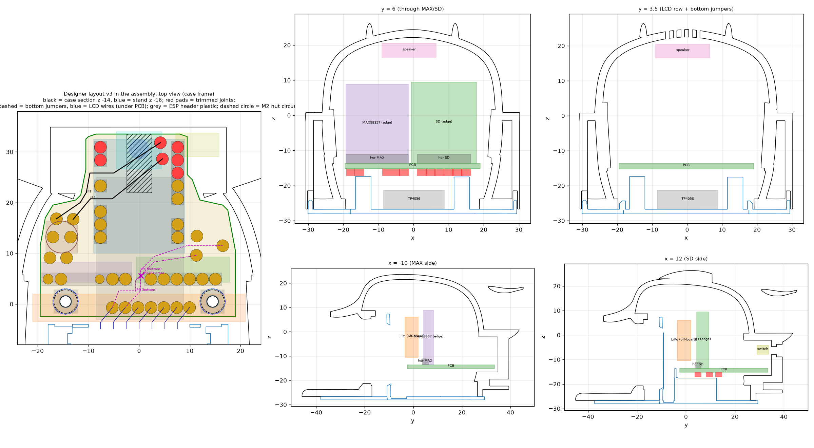

# PCB carrier Mochi rzmong (varian PCB)

PCB pembawa untuk case [`case_luar_lcd_23_40mm_pcb.stl`](../case/README.md#varian-pcb-carrier) + tatakan [`tatakan_GMT130_fit_pcb.stl`](../case/README.md#varian-pcb-carrier). Ini **varian opsional**. Rakitan kabel lepas (tanpa PCB) dengan case/tatakan lama tetap didukung.

- **Satu sisi, etsa tangan**, FR4 **1.6 mm**, semua **THT**. Tembaga di sisi bawah.
- **Outline 38.5 × 36 mm** (blok depan 38.5 × 13 mm + tab belakang lebar 20 mm). Ukuran 28 × 40 mm **tidak mungkin** di case ini.
- Koordinat = frame STL case (mm): −y = depan/LCD, +y = belakang/USB.
- Status: layout v3 **lolos cek fit** (FINAL GO, lihat [docs/fit/pcb_v3/REVIEW.md](../docs/fit/pcb_v3/REVIEW.md)) dan cek netlist/DRC ([v3/netlist_check_v3_output.txt](v3/netlist_check_v3_output.txt)). **Belum dibuat / dicetak uji.**

## 📁 File

| File | Isi |
| --- | --- |
| [v3/copper_mirrored_1to1.pdf](v3/copper_mirrored_1to1.pdf) | **Artwork etsa** (tembaga, sudah dicerminkan, skala 1:1). Cetak 100 %, cek bar 10 mm |
| [v3/copper_mirrored_1to1.svg](v3/copper_mirrored_1to1.svg) | Artwork yang sama dalam SVG |
| [v3/preview_component_side.png](v3/preview_component_side.png) / [.svg](v3/preview_component_side.svg) | Tampak sisi komponen (atas) |
| [v3/layout_case_frame.svg](v3/layout_case_frame.svg) | Layout di frame case |
| [v3/copper_preview.png](v3/copper_preview.png) | Pratinjau tembaga |
| [v3/layout_v3_case_frame.json](v3/layout_v3_case_frame.json) | Pad, jumper, lubang (frame case) — input cek fit |
| [v3/ASSEMBLY_NOTES.md](v3/ASSEMBLY_NOTES.md) | Catatan rakit lengkap (Inggris): pemotongan header, rute jumper, urutan solder |
| [v3/netlist_check_v3_output.txt](v3/netlist_check_v3_output.txt) | Hasil cek net + DRC (PASS, 9 catatan) |
| `v3/*.py`, `v3/routed.json` | Sumber desain: `layout_v3.py` (posisi), `route_v3.py` + `router.py` (routing), `geom_v3.py`, `check_v3.py` (net/DRC), `render_v3.py` (artwork) |
| [outline/pcb_recommended_outline_v2.dxf](outline/pcb_recommended_outline_v2.dxf) / [.svg](outline/pcb_recommended_outline_v2.svg) / [.json](outline/pcb_recommended_outline_v2.json) | Outline PCB + 2 lubang M2 |

Tidak ada file KiCad / skematik: desain dibuat langsung dengan skrip Python.

Generate ulang / cek (dari folder `pcb/v3`):

```bash
pip install numpy scipy shapely matplotlib cairosvg
python check_v3.py      # net + DRC, harus sama dengan netlist_check_v3_output.txt
python render_v3.py     # tulis ulang SVG/PDF artwork + pratinjau
```

## 🧩 Modul di PCB

| Modul | Catatan |
| --- | --- |
| ESP32-C3 Super Mini | Header 2.5 mm, USB-C ke belakang (masuk port belakang case) |
| Modul **micro SD 3.3 V** kecil, **±18.5 × 20 mm**, 6 pin | Berdiri di tepi, header siku. Urutan pin di PCB (kiri→kanan): MOSI, CS, GND, VCC, MISO, SCK. Shield Wemos (28 × 25.6) / Adafruit 4682 **tidak muat**. Banyak modul "mini micro SD" punya LDO + level shifter 5 V — **pastikan 3.3 V native** |
| MAX98357A | Berdiri di tepi, header siku. Pin SD dan GAIN dipotong. Speaker disolder langsung ke terminal modul |
| Kapasitor **470 µF 10 V, Ø6.3 × 11**, tegak | Ø8 **tidak muat** (tegak maupun rebah) |

## Di luar PCB (pakai kabel)

| Bagian | Catatan |
| --- | --- |
| TP4056 + DW01 (berproteksi) | Di lantai tatakan, USB-C ke slot bawah yang sudah ada. OUT+ → saklar (di luar PCB), OUT− → lubang "GND x2" |
| Saklar geser siku | Dilem di kantong kanan belakang, tuas lewat slot baru di dinding belakang |
| TTP223 | Menghadap atas di bawah atap depan, perlu ganjal foam/lem 2–3 mm. Mungkin perlu pad foil tembaga |
| Speaker **15 × 11 × 3.5 mm** (mis. PUI AS01508MS-SP11-WP-R) | Menghadap atas di bawah grille baru. Speaker bulat 20 mm **tidak muat** di varian PCB |
| LiPo **501640** (40 × 16 × 5 mm + PCM) | Berdiri di tepinya, foam 2 mm di depan modul SD/amp. Celah hanya 0.46 mm; sel ≤ 38 mm jauh lebih mudah |
| LCD GMT130 | 7 kabel, disolder ke pad bawah J1 (urutan RES SCL DC SDA GND BLK VCC) |

## Pemasangan

- 2 × **M2** di **(−14.5, 0.5)** dan **(14.5, 0.5)**, lubang PCB Ø2.2.
- Baut **M2 × 16 dari bawah tatakan**, naik lewat tiang Ø5, masuk ke mur M2 / standoff kuningan yang dilem/disolder di sisi atas PCB. Baut dari atas tidak mungkin (sisi atas ada di dalam case tertutup).
- Di belakang PCB bertumpu pada pad Ø4 di (0, 30.5) dan ditahan receptacle USB-C di port.

## 🛠️ Urutan rakit

1. Balik case. **Lem speaker, TTP223 dan saklar.**
2. **LiPo swing-in**: masukkan lewat bukaan bawah berdiri di ujungnya, putar mendatar, gulingkan ke tepinya, parkir di y −10..−4.5. Tidak bisa masuk lurus (bukaan bawah hanya 40–41.5 mm).
3. **Board slide-in**: PCB yang sudah terpasang naik vertikal 8 mm di depan posisi akhir, lalu geser +8 mm ke belakang.
4. Dorong LiPo +6.5 mm ke foam-nya.
5. **Tatakan dari bawah** bersama LCD (kabel sudah tersolder) dan TP4056.
6. Pasang **2 baut M2** dari bawah.

## Catatan solder (penting)

- Potong strip header ESP: buang pin IO2, IO7, IO9 **beserta plastiknya** (JP1 lewat slot IO7, JP2 lewat slot IO9). JP1/JP2 lewat di bawah ESP, jadi pasang **sebelum ESP**.
- **JP1 sebelum C1** — kawat JP1 hanya 0.10 mm dari badan kapasitor.
- **Solder sambungan di dekatnya dulu** (J1.DC, JP3.A, TTP.OUT, J2.MOSI, J3.LRC) **sebelum memasang kawat Kynar JP3/JP4** di sisi tembaga, supaya isolasinya tidak meleleh. JP3 dan JP4 **bersilangan di (0.3, 5.6)**: kunci dengan setetes lem atau Kapton.
- **Potong semua sambungan tab belakang** (U1.IO5, U1.IO6, U1.5V, U1.GND, U1.3V3, JP1.A, JP2.A) **≤ 1.0 mm** di bawah PCB, fillet rendah. Sambungan lain ≤ 2.0 mm. Tidak boleh ada solder di strip x ±2.5, y 22..33.5 (pad tumpuan).
- Pakai **26 AWG** atau lebih tebal untuk kabel GND gabungan (TTP223 GND + TP4056 OUT−, satu lubang 1.1 mm) dan **SW.B** (VIN dari saklar): arus baterai penuh, puncak ±1 A.
- **Kabel LCD**: naik di belakang LCD tetap di dalam **x ±9.5**; boleh melebar ke VCC (x 9.96) **hanya setelah melewati y −3.6**, di bawah PCB.

## Belum diverifikasi (cek dengan part asli)

- **Modul SD**: ukuran (±18.5 × 20 mm) dan urutan pin (MOSI, CS, GND, VCC, MISO, SCK). Kalau beda, sambung ulang dengan kabel agar cocok.
- **Posisi header ESP32-C3 Super Mini** yang persis.

Laporan fit lengkap: [docs/fit/REPORT.md](../docs/fit/REPORT.md) (Inggris). Skrip cek: [case/scripts/pcb_fit/](../case/scripts/pcb_fit/).


