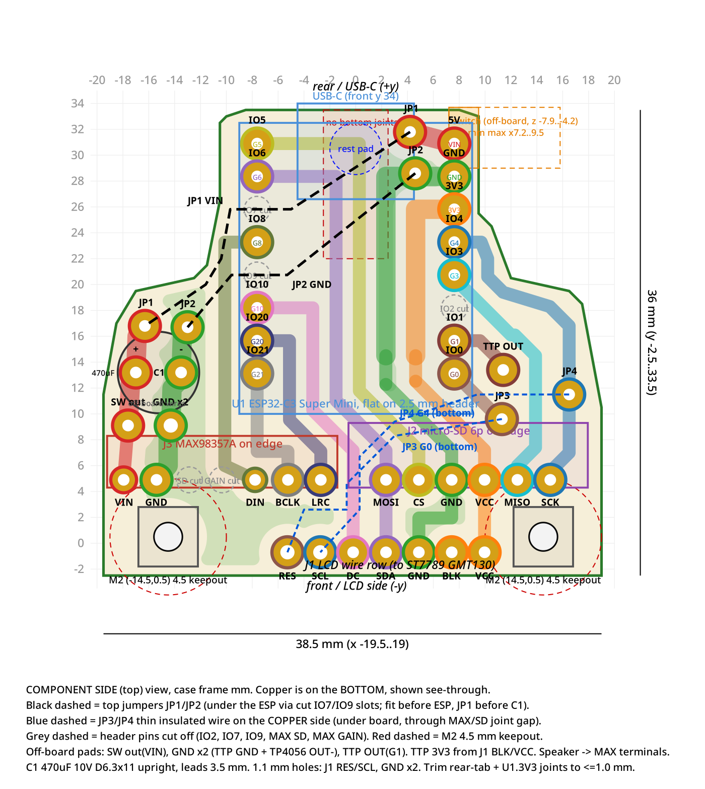
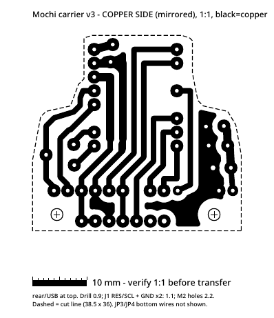

# PCB carrier v3 (etsa manual)

PCB carrier **satu sisi** (THT) untuk dietsa sendiri: gambar/transfer jalur, tutup dengan spidol permanen, etsa dengan **FeCl3**. Outline **berbentuk T 38,5 × 36 mm** (outline v2, lolos cek pas case). Koordinat memakai frame case: **−y = sisi LCD (depan)**, +y = belakang/USB. Tembaga di sisi bawah.

Status: layout v3 disetujui (cek netlist + DRC: [netlist_check_v3_output.txt](netlist_check_v3_output.txt) → `PASS`).

Panduan rakit lengkap (urutan, bor, jumper, trimming): **[ASSEMBLY_NOTES.md](ASSEMBLY_NOTES.md)** (bahasa Inggris).

## Pratinjau

| Sisi komponen | Tembaga (dicerminkan, untuk dicetak) |
| --- | --- |
|  |  |

## File

| File | Isi |
| --- | --- |
| `copper_mirrored_1to1.pdf` | **File cetak** — tembaga, sudah dicerminkan, skala 1:1 |
| `copper_mirrored_1to1.svg` | Sama, versi SVG |
| `copper_preview.png` | Pratinjau tembaga |
| `preview_component_side.png` / `.svg` | Pratinjau dari sisi komponen |
| `layout_case_frame.svg` | Layout di frame koordinat case |
| `layout_v3_case_frame.json` | Data layout (outline, lubang, pad, jalur) |
| `ASSEMBLY_NOTES.md` | Catatan perakitan |
| `netlist_check_v3_output.txt` | Hasil cek netlist / DRC / batasan case |
| `src/` | Skrip generator (`layout_v3.py`, `geom_v3.py`, `route_v3.py`, `router.py`, `render_v3.py`, `check_v3.py`) + `routed.json` |

## Cara cetak

1. Cetak `copper_mirrored_1to1.pdf` dengan skala **100 %** (matikan "fit to page").
2. Ukur **bar 10 mm** di hasil cetak — harus tepat 10 mm.
3. **Hitam = tembaga.** Gambar **sudah dicerminkan**, jangan dicerminkan lagi.

## Catatan penting

- **4 jumper:**
  - **JP1 / JP2** di sisi atas, di bawah ESP → pasang **pertama** (sebelum ESP). **JP1 sebelum C1** (jarak ke badan kapasitor hanya 0,1 mm).
  - **JP3 / JP4** kabel **30 AWG Kynar** di bawah papan (sisi tembaga) → pasang **terakhir**. Di titik silang beri lem atau Kapton.
- **Komponen di luar papan:** saklar geser, TTP223, TP4056, speaker (langsung ke terminal modul MAX98357).
- **Urutan pin SD** di papan (kiri → kanan): **MOSI, CS, GND, VCC, MISO, SCK**. Modul harus cocok atau dikabel ulang.
- Kabel **GND x2** (TTP223 GND + TP4056 OUT−) dan **SW.B** minimal **26 AWG** (arus baterai penuh, puncak ~1 A).
- Potong sambungan solder **tab belakang** (U1.IO5, IO6, 5V, GND, 3V3, JP1.A, JP2.A) **≤ 1,0 mm** di bawah papan.
- **Cocokkan dulu dengan komponen asli sebelum etsa:** pinout/posisi header **ESP32-C3 Super Mini** dan ukuran + urutan pin **modul SD**.

## Skrip `src/`

Hanya arsip/referensi — **tidak langsung jalan dari repo**:

- `layout_v3.py` membaca outline dari path absolut `/workspace/dasai-mochi/output/fit_components/pcb_recommended_outline_v2.json` (tidak ikut di repo; outline yang sama ada di `layout_v3_case_frame.json`).
- `geom_v3.py` membaca `/workspace/mochi-pcb/v3/routed.json` (path absolut).
- `render_v3.py` menulis output ke `/workspace/mochi-pcb/v3/`.
- `route_v3.py` / `check_v3.py` memakai path relatif (jalankan dari dalam `src/`).

Butuh Python + `shapely`, `numpy`, `scipy`, `matplotlib`, `cairosvg`. Sesuaikan path di atas jika ingin menjalankan ulang.
